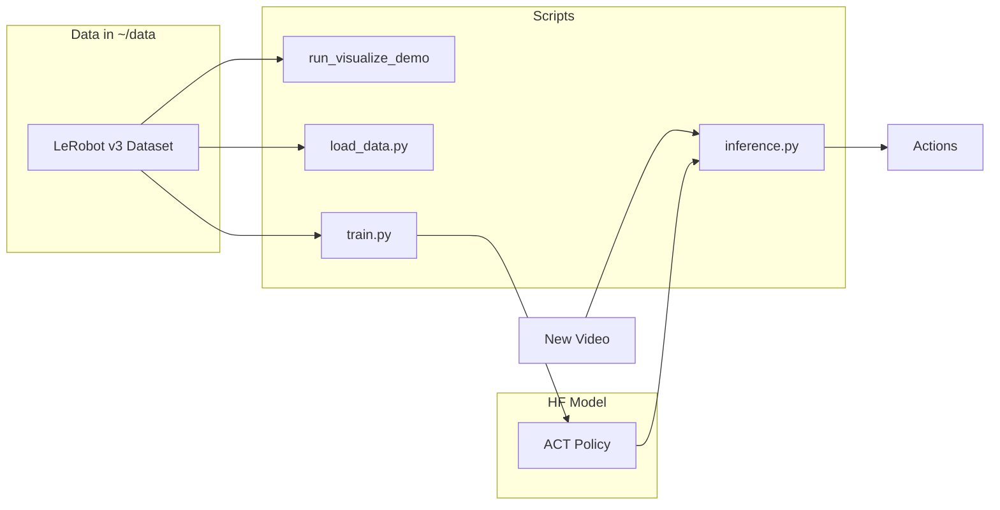

# pai-hack-26-pp

Team Policy Panic

Demo and scripts for [LeRobot](https://github.com/huggingface/lerobot): visualize datasets in `~/data`, load data, train ACT, and run inference on new videos.

## Setup

- Python 3.10+
- **UV** (recommended): `uv sync` — creates `.venv` and installs deps from `pyproject.toml`. Use `uv run python scripts/...` to run scripts.
- **pip**: `pip install -r requirements.txt`
- Optional: create `.env` with `HF_access_token` or `HUGGINGFACE_TOKEN` for Hub access (see below)

## Hugging Face token (optional)

For private repos or uploading models/datasets, create a `.env` file in the project root (do not commit it; it is in `.gitignore`):

```bash
# .env (any one of these names)
HF_access_token=your_hf_token
# or
HUGGINGFACE_TOKEN=your_hf_token
# or
HF_TOKEN=your_hf_token
```

Scripts load this via `python-dotenv` and set `HUGGINGFACE_HUB_TOKEN` for the Hugging Face Hub / LeRobot.

## Data (LeRobot v3 in ~/data)

Put LeRobot-format datasets under `~/data/<dataset_name>`. Each dataset directory should contain `data/`, `videos/`, and `meta/` (LeRobot v3 layout). You can:

- Record with `lerobot-record` and save to `~/data`, or
- Download from Hugging Face Hub and place under `~/data/<name>`.

Example: `~/data/pusht` with `data/`, `videos/`, `meta/`.

## Scripts

### 1. Visualize dataset (demo)

Uses `lerobot-dataset-viz` to view a dataset in `~/data` (opens Rerun).

```bash
./scripts/run_visualize_demo.sh [dataset_name] [episode_index]
# Example:
./scripts/run_visualize_demo.sh pusht 0
```

Default dataset name: `pusht`. Set `DATA_ROOT` to override `~/data`.

### 2. Load data

List datasets under `~/data` or load one and print metadata (episodes, frames, fps, camera keys).

```bash
# List datasets
python scripts/load_data.py

# Info for one dataset
python scripts/load_data.py pusht
python scripts/load_data.py pusht --root /path/to/data
python scripts/load_data.py pusht --episodes 0,1,2
```

### 3. Train ACT

Train ACT on a dataset in `~/data`. Uses `lerobot-train` with `--dataset.repo_id` and `--dataset.root`. If your lerobot version does not support `--dataset.root`, push the dataset to the Hub first or copy it to the cache directory.

```bash
python scripts/train.py pusht
python scripts/train.py pusht --root ~/data --output-dir outputs/train/act_pusht
python scripts/train.py pusht --dry-run   # print command only
```

### 4. Inference (new video)

Run ACT on a new video file. Output is the predicted action (and optionally written to a file).

```bash
python scripts/inference.py /path/to/video.mp4 --policy-path lerobot/act_pusht
python scripts/inference.py /path/to/video.mp4 --policy-path outputs/train/act_pusht --output action.json
# Multi-camera: one video per camera key, same order as --camera-keys
python scripts/inference.py cam1.mp4 cam2.mp4 --camera-keys "observation.images.top,observation.images.wrist" --policy-path lerobot/act_pusht
```

Input video resolution/fps should match training when possible. For multi-camera training, pass one video per camera in the same order as `--camera-keys`.

## Data flow


