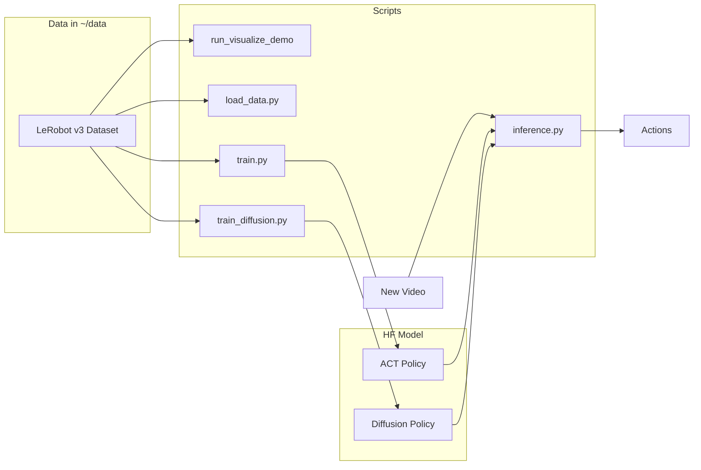

# pai-hack-26-pp

Team Policy Panic

Demo and scripts for [LeRobot](https://github.com/huggingface/lerobot): visualize datasets in `~/data`, load data, train ACT/Diffusion, and run inference on new videos. Focuses on **so101_bench_real** data (SO-101 robot with video observations).

## Setup

- Python 3.10+
- **UV** (recommended): `uv sync` — creates `.venv` and installs deps from `pyproject.toml`. Use `uv run python scripts/...` to run scripts.
- **pip**: `pip install -r requirements.txt`
- Optional: create `.env` with `HF_access_token` or `HUGGINGFACE_TOKEN` for Hub access (see below)

## Hugging Face token (optional)

For private repos or uploading models/datasets, create a `.env` file in the project root (do not commit it; it is in `.gitignore`):

```bash
# .env (any one of these names)
HF_access_token=your_hf_token
# or
HUGGINGFACE_TOKEN=your_hf_token
# or
HF_TOKEN=your_hf_token
```

Scripts load this via `python-dotenv` and set `HUGGINGFACE_HUB_TOKEN` for the Hugging Face Hub / LeRobot.

## Data (so101_bench_real in ~/data)

Put the so101_bench_real dataset under `~/data/so101_bench_real_2_v2.1`. The dataset contains `data/`, `videos/`, and `meta/` (LeRobot v3 layout) with:

- **Videos**: `observation.images.front`, `observation.images.overhead` (480x640)
- **State**: 6-D robot state
- **Actions**: 6-D

- **load_data.py** supports both v2.1 and v3.0; it reads `info.json` directly for v2.1 without modifying it.
- To convert v2.1 → v3.0 (run by another process):  
  `uv run python -m lerobot.datasets.v30.convert_dataset_v21_to_v30 --repo-id=so101_bench_real_2_v2.1 --root=/home/ubuntu/data --push-to-hub=false`
- For raw so101 episode-per-file format: `scripts/convert_so101_to_lerobot.py`

## Scripts

### 1. Visualize dataset (demo)

Uses `lerobot-dataset-viz` to view a dataset in `~/data` (opens Rerun).

```bash
./scripts/run_visualize_demo.sh [dataset_name] [episode_index]
# Example:
./scripts/run_visualize_demo.sh so101_bench_real_2_v2.1 0
```

Default dataset name: `so101_bench_real_2_v2.1`. Set `DATA_ROOT` to override `~/data`.

### 2. Load data

List datasets under `~/data` or load one and print metadata (episodes, frames, fps, camera keys).

```bash
uv run python scripts/load_data.py
uv run python scripts/load_data.py so101_bench_real_2_v2.1
uv run python scripts/load_data.py so101_bench_real_2_v2.1 --root /path/to/data
uv run python scripts/load_data.py so101_bench_real_2_v2.1 --episodes 0,1,2
```

### 3. Train ACT

Train ACT on so101_bench_real. Uses `lerobot-train` with `--dataset.repo_id` and `--dataset.root`.

```bash
uv run python scripts/train.py so101_bench_real_2_v2.1
uv run python scripts/train.py so101_bench_real_2_v2.1 --root ~/data --output-dir outputs/train/act_so101
uv run python scripts/train.py so101_bench_real_2_v2.1 --dry-run
```

### 4. Train Diffusion Policy

Train Diffusion policy on so101_bench_real (uses video/image observations).

```bash
uv run python scripts/train_diffusion.py so101_bench_real_2_v2.1
uv run python scripts/train_diffusion.py so101_bench_real_2_v2.1 --root ~/data --output-dir outputs/train/diffusion_so101
uv run python scripts/train_diffusion.py so101_bench_real_2_v2.1 --batch-size 16 --steps 50000 --dry-run
```

### 5. Inference (new video)

Run policy on a new video file. Output is the predicted action (and optionally written to a file). For so101_bench_real, camera keys are `observation.images.front` and `observation.images.overhead`.

```bash
uv run python scripts/inference.py /path/to/video.mp4 --policy-path outputs/train/diffusion_so101 --camera-keys observation.images.front
uv run python scripts/inference.py /path/to/video.mp4 --policy-path outputs/train/act_so101 --output action.json
# Multi-camera (front + overhead):
uv run python scripts/inference.py front.mp4 overhead.mp4 --camera-keys "observation.images.front,observation.images.overhead" --policy-path outputs/train/diffusion_so101
```

Input video resolution/fps should match training when possible.

## Data flow


